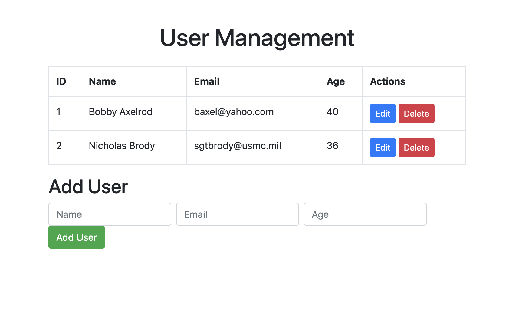

# Flo Assessment2 User DB API

This is a simple Flask App using API endpoints and Psycopg to interact with a PSQL database.  It allows for the easy CRUD'ing of users in a user database.

## Tech Stack

- **Flask**: Flask is a lightweight WSGI web application framework. It is designed to make getting started quick and easy, with the ability to scale up to complex applications.

- **PostgreSQL**: PSQL is a free and open-source relational database management system (RDBMS) emphasizing extensibility and SQL compliance.  It supports all major operating systems and handles a range of workloads from single machines to data warehouses, data lakes,[14] or web services with many concurrent users.

# Setting up Ansible and Terraform locally if necessary:
	sudo apt update
	sudo apt install terraform
	terraform -v # to Confirm installation
	sudo add-apt-repository ppa:ansible/ansible
	sudo apt update
	sudo apt install -y ansible
	ansible --version # to Confirm installation

# Add repository to your control node.

# Setup Terraform after reviewing unique settings and attributes in tf file on repository
	terraform init
	terraform plan
	terraform apply
# Update public EC2 IP and endpoint in the inventory.ini file, app.py and index.html.
	
# Review Ansible yml file on repo and setup correct settings and attributes
	ansible-playbook -i inventory.ini sys_depend.yml

# Connect to the EC2 instance, change unique information as necessary
	ssh -i /home/flomihciu/devops/tfdocker/flo-east1.pem ubuntu@3.217.28.40
	
# Next, confirm webpage and app are working properly. Afterwards, enjoy your app.
	sudo systemctl stop gunicorn
	sudo systemctl daemon-reload
	sudo systemctl start gunicorn
	sudo systemctl enable gunicorn
	sudo systemctl status gunicorn

